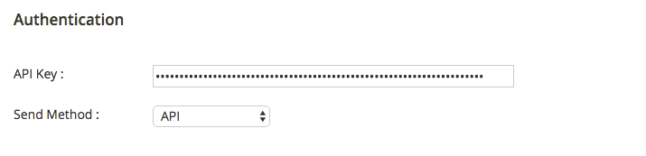
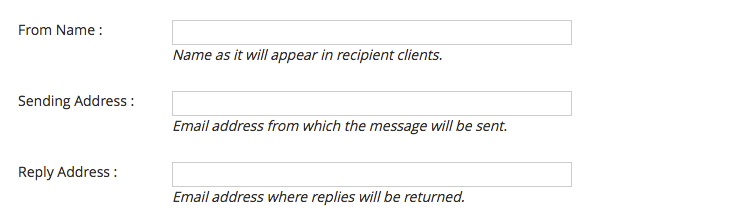
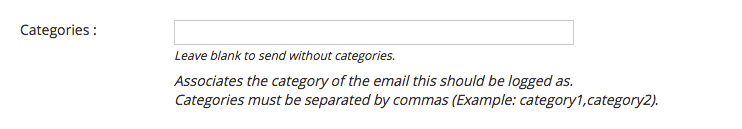
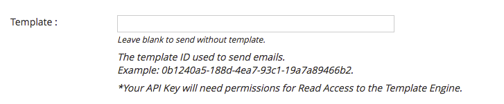
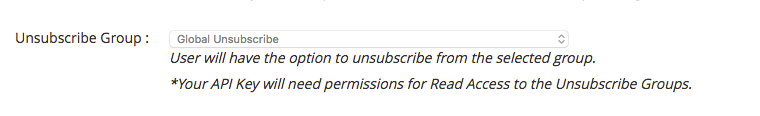
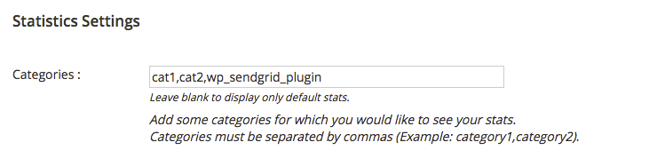
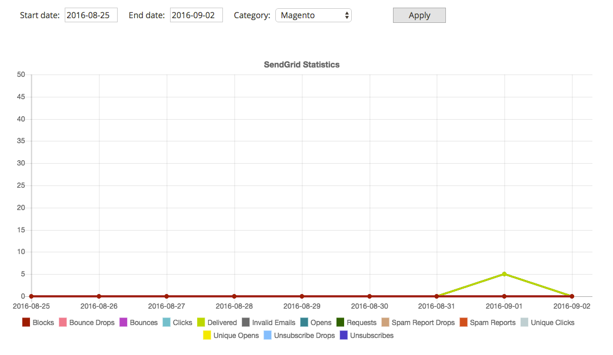

# SendGrid

This extension allows you to configure Magento 2 to send all emails using SendGrid.

## Description

SendGrid's cloud-based email infrastructure relieves businesses of the cost and complexity of maintaining custom email systems. SendGrid provides reliable delivery, scalability and real-time analytics along with flexible APIs that make custom integration a breeze.

The SendGrid plugin uses SMTP or API integration to send outgoing emails from your Magento installation.

## Configuration

Log into your Magento Admin, then go to System -> SendGrid -> Settings and enter your settings.

 - To get the SendGrid plugin running after you have activated it, go to the plugin's settings page and set the SendGrid API Key, then choose how your email will be sent - either through SMTP or API.

 - You can also set default values for the "From Name", "Sending Address" and the "Reply Address", so that you don't need to set these headers every time you want to send an email from your application.

 - Emails are tracked and automatically tagged for statistics within the SendGrid Dashboard. You can also add other category for your emails in the field "Categories".

 - You can set the template ID to be used in all your emails on the settings page.

 - You can select the unsubscribe group.

 - If you would like to configure categories for statistics, you can configure it by setting the 'Categories' field in the 'Statistics Settings' section

## Statistics
Log into your Magento Admin, then go to System -> SendGrid -> Statistics to see your statistics.

## Requirements
  * Magento Community Edition 2.x or Magento Enterprise Edition 2.x

## Frequently asked questions

#### What credentials do I need to add on settings page ?

Create a SendGrid account at <a href="https://sendgrid.com/partners/magento/" target="_blank">https://sendgrid.com/partners/magento/</a> and generate a new API key on <https://app.sendgrid.com/settings/api_keys>.

#### What permissions should my API keys have ?

The API Key needs to have Full Access to Mail Send, Read Access to Stats, Read Access to Template Engine and Read Access to Unsubscribe Groups.
